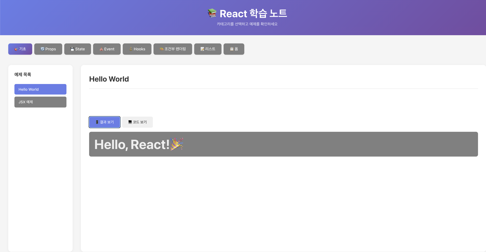
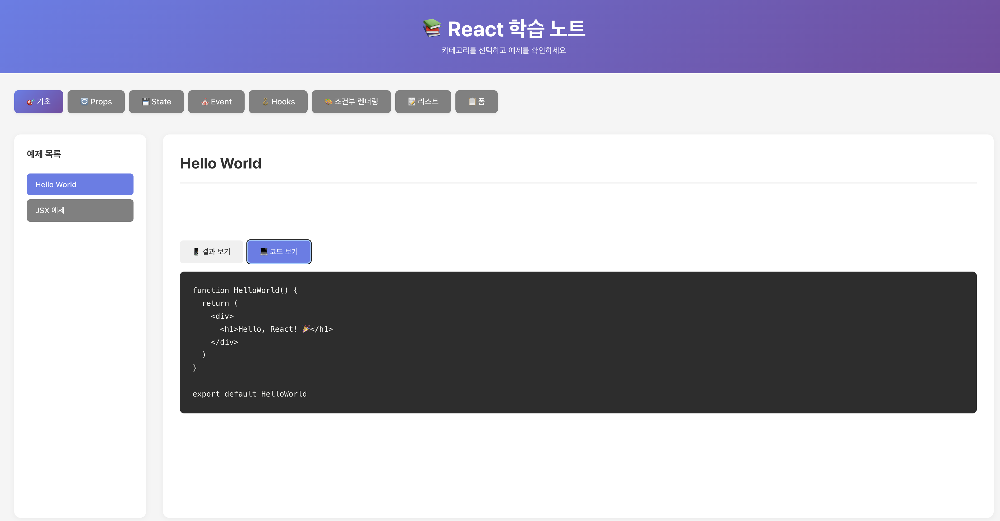

# 📚 React Learning Note

React를 체계적으로 학습하고 실습한 내용을 정리한 저장소입니다.

## 🎯 프로젝트 소개

이 프로젝트는 React의 핵심 개념들을 카테고리별로 나누어 학습하고, 각 개념마다 실습 예제와 코드를 함께 정리한 인터랙티브 학습 노트입니다.

## ✨ 주요 기능

- 📑 **카테고리별 학습**: React 개념을 8개 카테고리로 구분
- 🔄 **탭 전환 UI**: 결과 보기 / 코드 보기 탭으로 실행 결과와 코드를 비교
- 💻 **실시간 실습**: 각 예제를 직접 실행하고 확인 가능
- 📱 **반응형 디자인**: 모바일부터 데스크톱까지 모든 화면 크기 지원

## 📸 스크린샷

### 메인 화면


### 예제 실행 화면


## 📖 학습 카테고리

### 🎯 기초
- Hello World
- JSX 문법
- React 기본 개념

### 🔄 Props
- Props 기본 개념
- Props Children
- Props 전달 방법

### 💾 State
- useState Hook
- State 관리
- 상태 업데이트

### 🎪 Event
- 이벤트 핸들링
- 이벤트 객체
- 폼 이벤트

### 🪝 Hooks
- useEffect
- useState
- Custom Hooks
- useContext, useRef, useMemo, useCallback

### 🎨 조건부 렌더링
- 삼항 연산자
- && 연산자
- if문 활용

### 📝 리스트 렌더링
- map 함수
- key prop
- 배열 데이터 처리

### 📋 폼 처리
- 제어 컴포넌트
- 여러 Input 관리
- 유효성 검사

## 🛠️ 기술 스택

- **React** 18.x
- **Vite** - 빠른 개발 서버
- **JavaScript (ES6+)**
- **CSS3** - Flexbox, Grid

## 🚀 시작하기

### 설치

```bash
# 저장소 클론
git clone https://github.com/Leedoseo/React_learning_note.git

# 프로젝트 폴더로 이동
cd React_learning_note

# 의존성 설치
npm install
```

### 실행

```bash
# 개발 서버 실행
npm run dev
```

브라우저에서 `http://localhost:5173` 접속

## 📁 프로젝트 구조(계속 업데이트 예정)

```
react-study/
├── src/
│   ├── components/
│   │   ├── 01-basics/
│   │   │   ├── HelloWorld.jsx
│   │   │   └── JSXExample.jsx
│   │   ├── 02-props/
│   │   │   ├── PropsBasic.jsx
│   │   │   └── PropsChildren.jsx
│   │   ├── 03-state/
│   │   │   ├── Counter.jsx
│   │   │   └── InputState.jsx
│   │   ├── 04-event/
│   │   ├── 05-hooks/
│   │   ├── 06-conditional/
│   │   ├── 07-list/
│   │   └── 08-form/
│   ├── App.jsx
│   ├── App.css
│   └── main.jsx
├── package.json
└── README.md
```

## 💡 사용 방법

1. **카테고리 선택**: 상단의 카테고리 버튼을 클릭하여 학습하고 싶은 주제 선택
2. **예제 선택**: 왼쪽 사이드바에서 구체적인 예제 선택
3. **결과 확인**: "📱 결과 보기" 탭에서 실행 결과 확인
4. **코드 학습**: "💻 코드 보기" 탭에서 해당 코드 확인

## 📚 참고 자료

- [React 공식 문서](https://react.dev/)
- [Vite 공식 문서](https://vitejs.dev/)

## 👨‍💻 작성자

**도서** (Leedoseo)
- GitHub: [@Leedoseo](https://github.com/Leedoseo)
